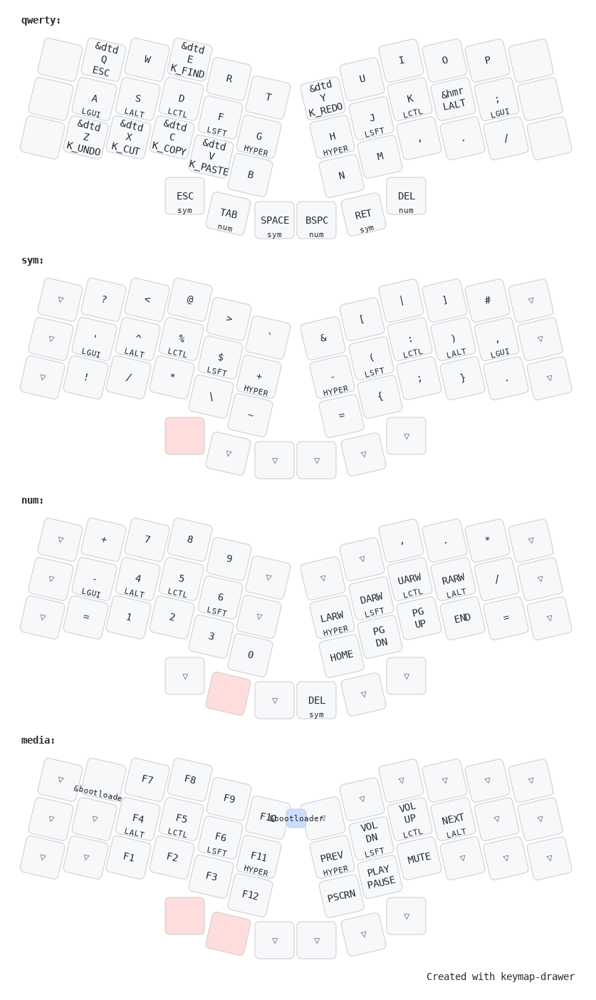

# Keyboards

## MCUs

### Seeeduino BLE
#### Enter bootloader mode
Click reset button twice. Hard drive should appear and ready to push the uf2 there.

### nice!nano
#### Enter bootloader mode
Click reset button twice. Hard drive should appear and ready to push the uf2 there.

## Boards

### Revxlp
- https://gitlab.com/lpgalaxy/revxlp

### Revxlp (Joe)

#### Keymap

Paste the keymap file into https://keymap-drawer.streamlit.app/

