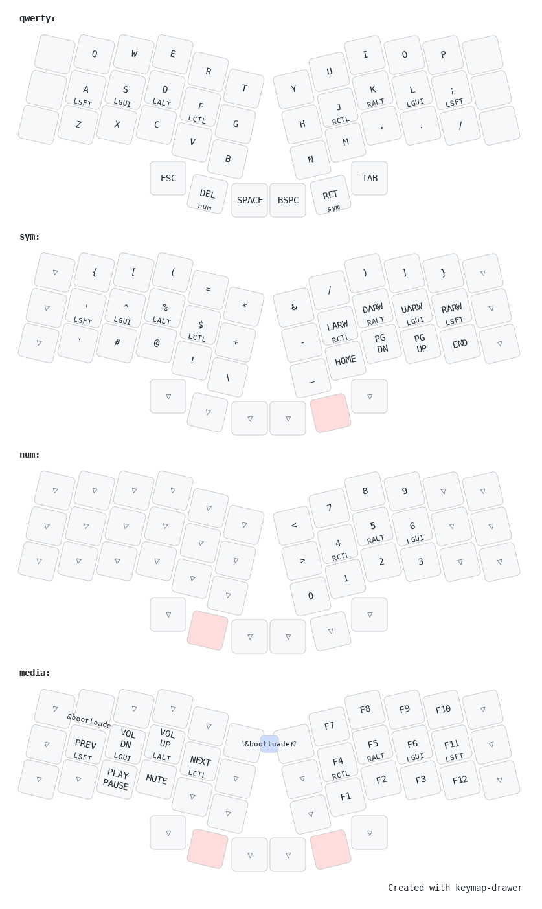

# Revxlp

## Original reference
- https://gitlab.com/lpgalaxy/revxlp

## Enter bootloader mode

### Seeeduino BLE
Click reset button twice. Hard drive should appear and ready to push the uf2 there.

## Keymap

Paste the keymap file into https://keymap-drawer.streamlit.app/

